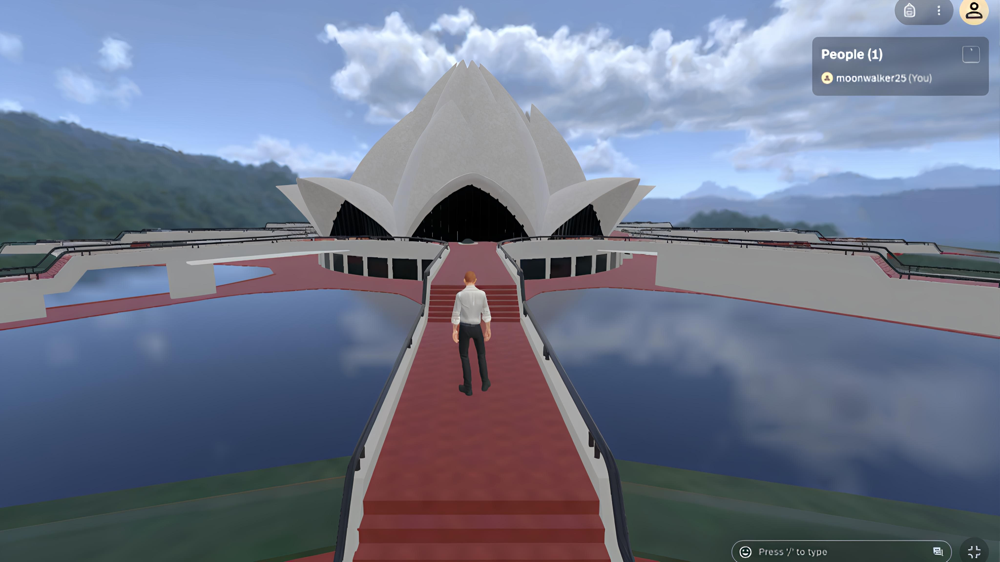

# BharatVerse  

**Journey Through India's Heritage in Virtual Reality**  

  

  

BharatVerse is a transformative metaverse platform designed to mirror and enhance India’s cultural, educational, and developmental experiences. Powered by AI, immersive tech, and sustainability principles, it bridges physical barriers to create a dynamic virtual ecosystem aligned with Viksit Bharat 2047’s vision.  

## The Challenge  
India’s progress faces critical gaps:  
- 🌏 **Geographical Barriers**: Limited access to cultural heritage sites and educational resources.  
- 📚 **Digital Literacy Divide**: Uneven adoption of technology-driven learning tools.  
- 🌱 **Sustainability Awareness**: Lack of engaging platforms to promote eco-conscious practices.  
- 🤝 **Fragmented Collaboration**: Minimal spaces for cross-sector innovation and community building.  

## Our Solution  
A **AI-powered metaverse** offering:  
- 🕶️ **Virtual Heritage Tours**: Explore UNESCO sites, historical monuments, and cultural festivals in immersive VR.  
- 🧠 **AI Companion "Disha"**: 24/7 chatbot for travel guidance, cultural insights, and educational support.  
- 🎨 **Customizable Avatars**: Design personal avatars with traditional Indian attire and accessories.  
- 🌿 **Sustainability Hubs**: Interactive modules on eco-friendly practices and smart city planning.  
- 👥 **Collaborative Spaces**: Virtual classrooms, business incubators, and government-citizen interaction zones.  

## Key Features  
| Category              | Features                                                                                   |
|-----------------------|-------------------------------------------------------------------------------------------|
| **Immersion**         | VR/AR heritage tours, 3D-rendered cities, Unreal/Unity environments                       |
| **Education**         | Digital literacy workshops, AI-curated cultural courses, live expert sessions             |
| **Community**         | Multi-user collaboration tools, virtual town halls, regional language support             |
| **Sustainability**    | Gamified eco-challenges, carbon footprint trackers, green infrastructure simulations      |
| **Accessibility**     | Mobile/desktop compatibility, low-bandwidth optimization, assistive tech integration      |

## Technology Stack  
- **Metaverse Engine**: Unreal Engine, Unity, Oculus SDK  
- **AI & Chatbot**: ChatGPT API, Voiceflow, TensorFlow (NLP)  
- **Tracking**: MediaPipe (posture), OpenXR/MetaXR (hand gestures)  
- **Web**: MERN stack (MongoDB, Express.js, React, Node.js)  
- **3D Modeling**: Blender, Mobile Viewer API  
- **Auth & DB**: Firebase, PostgreSQL  
- **UI/UX**: Figma-designed interfaces  

## Unique Selling Points  
- 🏛️ **Cultural Preservation**: Digitally archive endangered traditions and historical narratives.  
- 🛠️ **Design Flexibility**: Customize avatars, virtual spaces, and learning pathways.  
- 🌐 **Bharat 2047 Vision**: Align with national goals for innovation, sustainability, and inclusivity.  
- 📲 **Cross-Platform**: Seamless transition between VR headsets, mobile apps, and web browsers.  

Made with ❤️ for a Viksit Bharat.  
